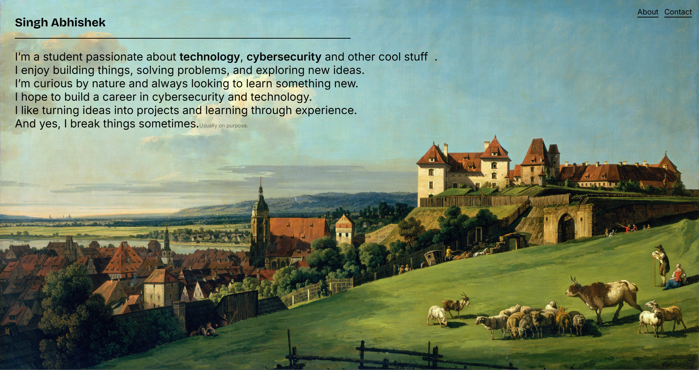
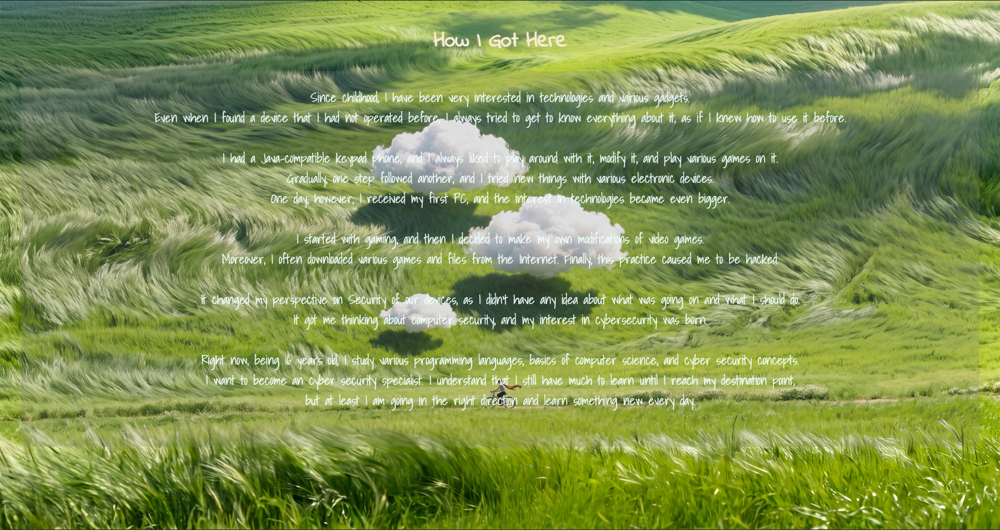
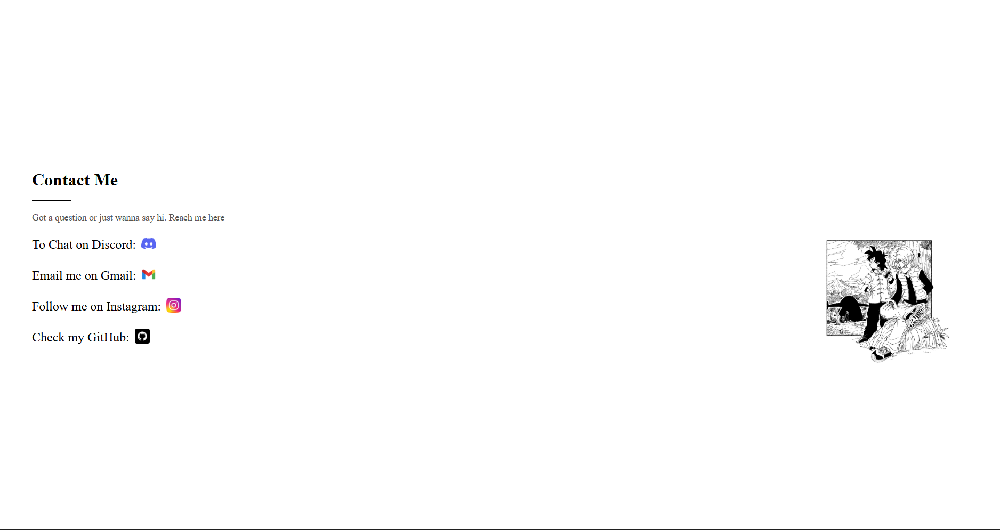

# Personal-website
- **TO VISIT** : [[Click Here](https://abhishek0term.github.io/Personal-website/)]
- This is my first every website that i have created using **HTML**. 
I'm still learning html and I look forward to add new features to my website as i grow my skill set.

## Pages
- There are three pages on my website
### Home Page

- I tried to keep this page very simple and professional.
This page contains my name and some interest of mine.
- You can also see two buttons (hyperlinks) in the top right corner of this page.
Those buttons (hyperlinks) lead to my contacts and a small story about me on how I got into tech and cyber security
- This page also contains a song as background music which is **her - JVKE**

### About page 

- This page was created just to simply tell my story on how i got interested in tech and cybersecurity.

### Contacts Page

- This page is very simple this page contains contact of all of my social media

## My Goal
- I look forward to add an portfolio page into this website,
when i have some good stuff to show.
